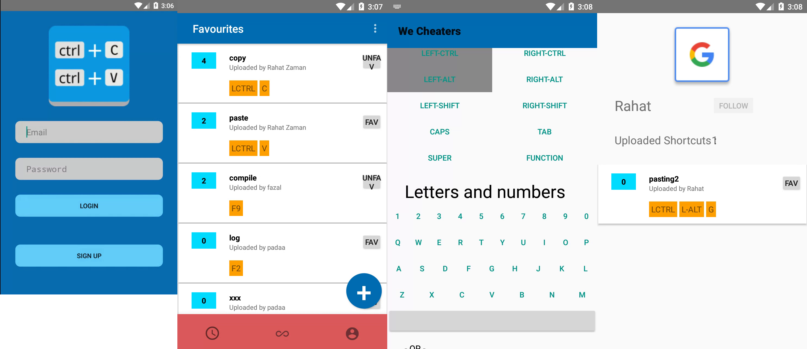
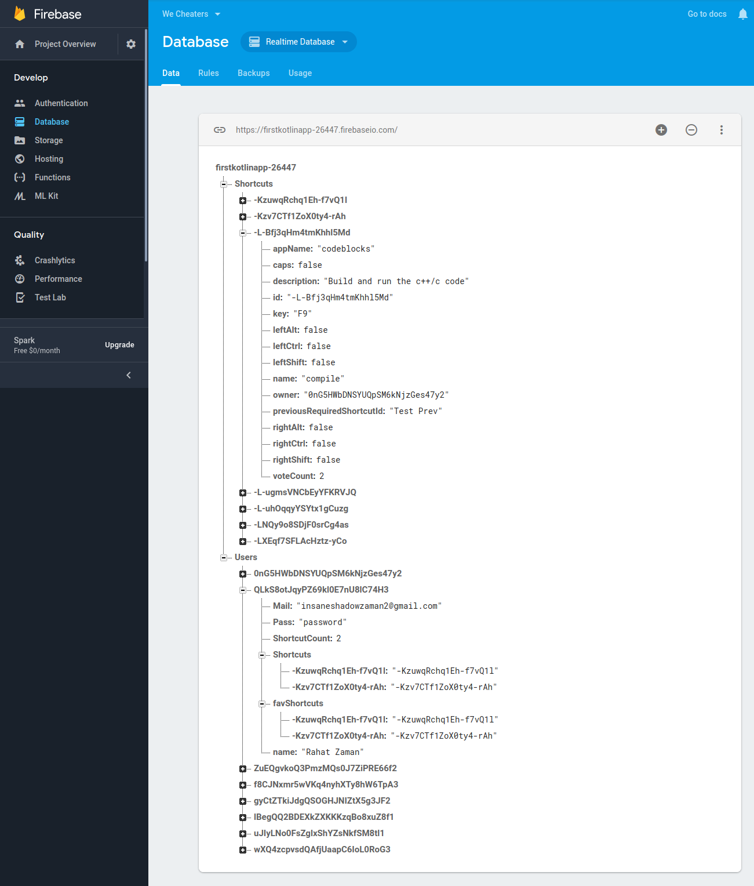

# We Cheaters android app

> Primary version

## Description
This is an android app which can be used to store and share different shortcut key bindings with other users.

## Motivation
This was an academic project for my second year second semester course CSE-2200, Advance Programming. I have learned how to use google's firebase api.
My firebase database snapshot:

## Getting started
Download the project, open it with android studio, upgrade some gradle stuff, and you'll be good to go. May need to replace the google-services.json file with your one.

## Features
What this app can do?
* Create shortcut of any kind of key bindings.
* Share the shortcut publicly with all other we cheater app users.
* Make others shortcuts favourite so that you can see those quickly from the bottom navigation bar.

## Contributing
The main reason to publish something open source, is that anyone can just jump in and start contributing to my project.

So If you'd like to contribute, please fork the repository and use a feature branch. Pull requests are warmly welcome.

## Links and References
- Project homepage: https://github.com/rahatzamancse/android-app-we-cheaters
- Repository: https://github.com/rahatzamancse/android-app-we-cheaters.git
- Issue tracker: https://github.com/rahatzamancse/android-app-we-cheaters/issues
- In case of any help you may need from me, please contact rahatzamancse@gmail.com directly without any hesitation! I will be glad to help you.
- Firebase: https://firebase.google.com
- Android Developer: https://developer.android.com/

## Author
Rahat Zaman
rahatzamancse@gmail.com
Student at Department of Computer Science and Engineering
Khulna University of Engineering & Technology, Khulna
Bangladesh

## Licensing
The code in this project is licensed under GNU GPLv3 license.
